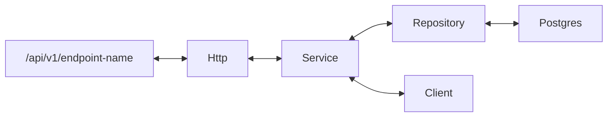

### About

An email and sms notification system

<!-- ### Architecture

 -->
### Local Development
Taskfile is used for running build commands,
simply run `task run` to execute a docker build + serve command

### Tools Needed

- Go 1.16
- [Docker & Docker Compose](https://docs.docker.com/get-docker/)
- [Taskfile](https://taskfile.dev/#/installation)
