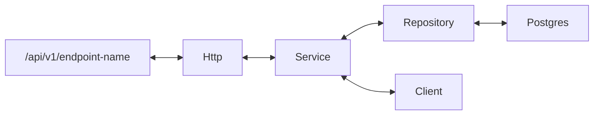

### About

An email and sms notification system

### Start Local Instance

Start up a local instance of the application, using docker build + serve

From terminal run: `task run`

### Run Testing Suite

From terminal run: `task integration-test`

### Operating System Tools Needed

- Go 1.16
- [Docker & Docker Compose](https://docs.docker.com/get-docker/)
- [Taskfile](https://taskfile.dev/#/installation)

### Overview

Http = internal/transport/http\
Service = internal/comment/comment\
Repository = internal/db
